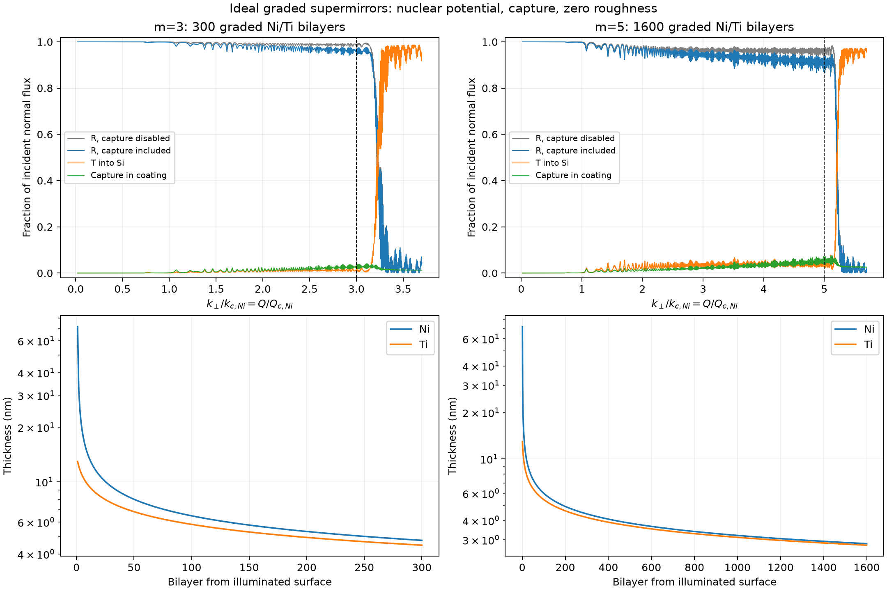
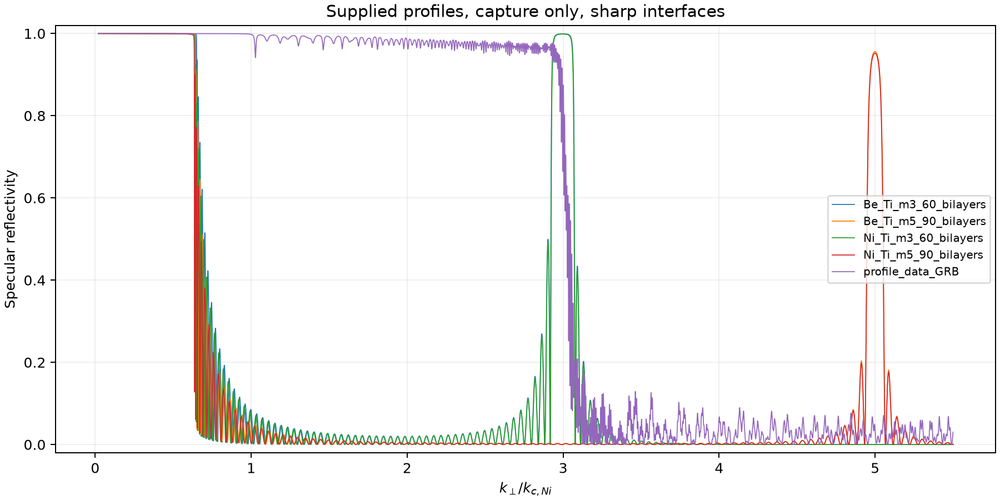

# Neutron supermirrors: designs, wave fields, absorption, and code review

This review covers all code cells in `new-wave-vibe.ipynb`, `new-wave-bragg.ipynb`, and `neutron_fields_configurable.ipynb`, the five supplied layer profiles, and the three supplied articles. The original notebooks and profiles have been retained. New designs and independently checked calculation scripts accompany this report.

**Main result:** the ordinary-grid wave-field and analytic absorption calculations are correct for the stated scalar, planar, capture-only optical model. However, the existing `*_m3_60_bilayers.npy` and `*_m5_90_bilayers.npy` files are periodic Bragg reflectors, not broadband supermirrors. There are also material-label/constant inconsistencies, an exact-critical-point failure, and plotting limitations. New graded Ni/Ti designs address the broadband structure request; they are ideal theoretical designs, not validated manufacturing specifications.

## 1. Sources and conventions

- **[K]** R. Kolevatov, C. Schanzer, P. Böni, *Neutron absorption in supermirror coatings: Effects on shielding*, supplied [1708.04486.pdf](1708.04486.pdf), arXiv:1708.04486v2, 31 May 2018. The requested number `1706.04486` differs from the supplied paper. Page numbers below are the PDF's printed page numbers.
- **[A]** V. L. Aksenov, V. K. Ignatovich, Yu. V. Nikitenko, *Neutron Standing Waves in Layered Systems*, Crystallography Reports **51**, 734–753 (2006), DOI [10.1134/S1063774506050038](https://doi.org/10.1134/S1063774506050038), supplied [aksenov2006.pdf](aksenov2006.pdf). References use journal page numbers; pp. 740–741 are PDF pages 7–8.
- **[D]** D. D. DiJulio et al., *Measurements of the neutron absorption in supermirror coatings*, supplied [2112.02883v1.pdf](2112.02883v1.pdf), arXiv:2112.02883v1 (2021).

Let z be depth into the mirror, theta the grazing angle, and lambda the vacuum wavelength. Distinguish three quantities:

\[
 k_0=2\pi/\lambda,\qquad k_\perp=k_0\sin\theta,
 \qquad Q=2k_\perp=(4\pi/\lambda)\sin\theta.
\]

The notebooks' argument `q` is **k_perp**, whereas the reflectometry momentum transfer in the papers' plots is **Q**. [D], §2.2, p. 6 explicitly defines its `q_z` as `(4*pi/lambda)*sin(theta)`. A factor-of-two error here moves every cutoff and absorption normalization.

Lengths in the optical calculation are angstroms. The `.npy` profiles contain **nanometres**, with columns `[pair_number, high-SLD_thickness_nm, Ti_thickness_nm]`. Multiplication by 10, followed by flattening the last two columns, is correct. The first column is an index, not a thickness or a material parameter. Rows run from the illuminated surface toward the substrate, Ni then Ti within each new pair; reverse the physical layer sequence when planning deposition from the substrate outward.

The nuclear scattering-length density (SLD) is written

\[
 \rho=\rho'-i\rho''_a,\quad\rho''_a\ge0,\qquad
 U=\frac{2\pi\hbar^2}{m_n}\rho.
\]

Here rho is SLD, while [K] uses rho for **atomic number density**. Thus [K]'s `rho*b_c` corresponds to our real SLD. Notebook SLD columns must be multiplied by `1e-6` to obtain angstrom^-2.

## 2. Why multilayers reflect neutrons

A neutron is coherently scattered by nuclei throughout each material. At grazing incidence its small normal kinetic energy is comparable to the effective nuclear optical potential, even though its total kinetic energy is much larger. Translational invariance parallel to flat interfaces allows the lateral plane wave to be factored out ([K], Eq. 8). The normal wave then satisfies

\[
 \psi_j''+k_j^2\psi_j=0,\qquad
 k_j^2=k_\perp^2-4\pi(\rho'_j-\rho'_0)+i4\pi\rho''_{a,j}.
\]

This is [K], Eqs. 9 and 11, with diffuse attenuation set to zero and a possible nonzero, nonabsorbing incident-medium SLD included by subtraction. For the forward-wave convention `exp(+i*k_j*z)`, choose `Im(k_j)>=0`. In an absorbing medium the wave decays into the material; reversing the absorption sign would create unphysical gain. Below a positive real potential, the lossless wave is evanescent rather than propagating.

At a sharp interface, continuity of psi and psi' gives amplitude coefficients

\[
 r_{ij}=\frac{k_i-k_j}{k_i+k_j},\qquad
 t_{ij}=\frac{2k_i}{k_i+k_j},\qquad r_{ji}=-r_{ij}.
\]

These follow from [K], Eq. 12 and appear in [A], Eqs. 59, 61, and 67. **Amplitude coefficients are not probabilities.** Transmission probability needs a velocity/normal-current ratio.

Nickel has positive nuclear SLD and titanium negative SLD, providing a large interface contrast. A periodic bilayer makes reflections from many boundaries add coherently near its Bragg condition. Quarter-wave optical thicknesses, `k_Ni*d_Ni=k_Ti*d_Ti=pi/2`, give a strong first-order reflection band at the chosen normal momentum. Repeating the same bilayer sharpens that band; it does not create high reflection at all smaller momenta above the effective critical region.

A supermirror grades the layer thicknesses. Different depths reflect different normal momenta, overlapping their reflection bands. Thick layers near the incident surface cover the low-momentum part; progressively thinner layers deeper in the coating cover higher momenta. The thickness profile, contrast, layer count, capture, and interface quality jointly determine the usable reflectivity.

The conventional nominal m value specifies

\[
 m=Q_{\max}/Q_{c,\rm Ni}=k_{\perp,\max}/k_{c,\rm Ni},\qquad
 k_{c,\rm Ni}=\sqrt{4\pi\rho'_{\rm Ni}}.
\]

Equivalently, `sin(theta_max)=m*sin(theta_c,Ni)` at fixed wavelength; the often-used `theta_max≈m*theta_c,Ni` is a small-angle approximation. m alone does not define a unique structure or guarantee a particular reflectivity threshold. It remains referenced to Ni even when another high-SLD material is used.

## 3. New m=3 and m=5 structures

[generate_supermirrors.py](generate_supermirrors.py) creates:

- [supermirrors/Ni_Ti_supermirror_m3.npy](supermirrors/Ni_Ti_supermirror_m3.npy)
- [supermirrors/Ni_Ti_supermirror_m5.npy](supermirrors/Ni_Ti_supermirror_m5.npy)

These are float64 arrays in the example profile's three-column format. Their SLDs, assumptions, dimensions, validation grids, and numerical residuals are recorded in [design_metadata.json](supermirrors/design_metadata.json).

For pair j=0,...,N-1, the explicit design rule is

\[
 s_j=\left[1.02^4+\frac{j}{N-1}\big((m+0.2)^4-1.02^4\big)\right]^{1/4},
 \quad
 d_{j,a}=\frac{\pi}{2\sqrt{(s_jk_{c,\rm Ni})^2-4\pi\rho'_a}},
 \quad a\in\{\mathrm{Ni,Ti}\}.
\]

Thicknesses from this expression are in angstroms and are divided by 10 for storage. The fourth-power grading allocates more bilayers to the higher-momentum region where interface reflection is weak. The upper padding of 0.2 places the last local Bragg centre beyond the nominal usable edge. Parameters and counts were selected using calculated broadband reflectivity, not just the location of a Bragg peak.

**This chirp is an explicit design choice developed here.** It is not an equation claimed to occur in the supplied papers and is not a reproduction of the commercial Hayter–Mook designs used in [K], §4.1. [K] references that method as Hayter and Mook, J. Appl. Cryst. **22**, 35–41 (1989); the full design procedure is not supplied in these articles. The present structures are not optimized for minimum layer count, coating stress, fabrication time, or roughness tolerance.

| Quantity | m=3 | m=5 |
|---|---:|---:|
| Bilayers / finite layers | 300 / 600 | 1600 / 3200 |
| Total coating thickness | 3.8110 micrometres | 12.1162 micrometres |
| Ni thickness range | 4.7526–71.8755 nm | 2.8311–71.8755 nm |
| Ti thickness range | 4.4702–12.9475 nm | 2.7678–12.9475 nm |
| Nominal Q_max | 0.0652378 angstrom^-1 | 0.1087297 angstrom^-1 |
| Minimum sampled R, 0.02<=k_perp/k_c<=m | 0.940056 | 0.865308 |
| R exactly at nominal m | 0.947499 | 0.921230 |
| Chosen minimum acceptance threshold | 0.90 | 0.85 |

Each band was checked at **24,001 uniformly spaced points**, with no resolution averaging to smooth away dips. This is numerical evidence on a dense grid, not a mathematical bound between all grid points. The m=5 design does not meet a uniform 90% requirement; its specified acceptance threshold here is 85%. Increasing the layer count alone need not improve the minimum, because capture and interference can offset the gain.

The calculation includes bulk nuclear SLD and capture, a vacuum incident medium, and a semi-infinite Si substrate. It excludes roughness, interdiffusion, magnetic SLD, thickness errors, and instrument resolution. It therefore does not establish achievable measured reflectivity, especially for the thick m=5 stack with layers near 3 nm. Full curves, including Ni and Ti capture separately, are in `m3_response.npz` and `m5_response.npz`; a shareable vector figure is in `design_validation.pdf`.

The supplied `profile_data_GRB.npy` contains 274 graded pairs, total thickness 3.82047 micrometres. When interpreted as Ni/Ti using the verified bulk constants, R≈0.9804 at m_coordinate=2, 0.9807 at 2.5, and 0.8606 at 3; its first sampled R<0.90 above m_coordinate=1 occurs near 2.972. It is consistent with an approximately m=3 design, rather than the suggested m≈2, but no fabrication or nominal-rating metadata are present in the array.

By contrast, the supplied periodic Ni/Ti m=3 file gives R≈0.99855 at m_coordinate=3 but only 0.00495 at 2. A high peak at 3 does not make it a broadband m=3 supermirror. The same issue affects the periodic m=5 and Be/Ti files.

## 4. Wave functions and stable numerical amplitudes

[K], Eq. 10 expresses the field in a layer measured from its left boundary:

\[
 \psi_j(x)=\alpha_j e^{ik_jx}+\beta_j e^{-ik_jx},\quad 0\le x\le d_j.
\]

The notebooks use an equivalent and more stable convention:

\[
 \psi_j(x)=A_j e^{ik_jx}+B_j e^{ik_j(d_j-x)},\qquad
 A_j=\alpha_j,\quad \beta_j=B_j e^{ik_jd_j}.
\]

Thus `B_right` is referenced to the **right** interface. Substituting it directly for the left-referenced beta in a paper's formula would be wrong. Both exponential factors used inside a finite passive layer have modulus at most one, avoiding the exponentially growing factors that make a long transfer-matrix product unstable.

Let `p_j=exp(i*k_j*d_j)` and let E_j be reflection from the remaining stack at the right boundary of layer j. The backward recursion uses the load `l_j=p_(j+1)^2*E_(j+1)`:

\[
 E_j=r_{j,j+1}+\frac{t_{j,j+1}t_{j+1,j}\,l_j}{1-r_{j+1,j}l_j}
     =\frac{r_{j,j+1}+l_j}{1+r_{j,j+1}l_j}.
\]

It ends at the substrate interface, with no incoming substrate wave. The forward pass reconstructs A and B from the transmission factors and these loads. This is the scalar multiple-reflection composition of [A], Eqs. 7–10 and 55–58, algebraically equivalent to the boundary matrices in [K], Eqs. 12–14. A finite coating has incident amplitude 1, reflected amplitude r, and only an outgoing/decaying substrate wave.

The density `|psi|^2` contains interference between forward and backward waves. It can exceed one locally; it is a density enhancement relative to the incident wave, not a reflection or absorption probability. Standing-wave antinodes increase the capture rate in absorptive layers; nodes suppress it. [A], Eqs. 11–19 and §4 explain this mechanism and resonant enhancement. For a simple lossless cavity the round-trip phase condition is `2*k_i*L_i+phi_1+phi_2=2*pi*n`; a graded supermirror contains many coupled interfaces and must be solved as a whole.

## 5. Absorption and the normalization issue

The unambiguous starting point is the normal probability current:

\[
 J_z=\frac{\hbar}{2i m_n}(\psi^*\psi'-\psi\psi'^*)
     =\frac{\hbar}{m_n}\operatorname{Im}(\psi^*\psi').
\]

For unit incident amplitude in a nonabsorbing incident medium,

\[
 J_{\rm in}=\frac{\hbar k_\perp}{m_n},\qquad
 R=|r|^2,\qquad
 T=\frac{\operatorname{Re}k_s}{k_\perp}|A_s|^2.
\]

These are [K], Eqs. 15, 18, and 19. T is the current **entering the substrate**, not the fraction emerging from the far side of a finite substrate. Subsequent capture in semi-infinite Si is not coating capture.

Using the wave equation gives

\[
 \frac{d}{dz}\operatorname{Im}(\psi^*\psi')
       =-4\pi\rho''_a|\psi|^2.
\]

Consequently the capture probability per incident neutron in finite layer j is

\[
 \boxed{P_j=\frac{4\pi\rho''_{a,j}}{k_\perp}
                 \int_{z_j}^{z_{j+1}}|\psi(z)|^2\,dz}
       =\frac{J_z(z_j)-J_z(z_{j+1})}{J_{\rm in}}.
\]

This derives the notebook's `4*pi*1e-6*im_sld*integral/k_inc` and agrees with [K], Eq. 20 when all optical loss is capture. It is dimensionless: `(angstrom^-2)*(angstrom)/(angstrom^-1)=1`. Every layer uses the same **incident normal wavevector** in the denominator. Replacing it by a local complex k_j, its magnitude, or the total wavevector gives a different normalization.

[A], §4, pp. 740–741, provides the requested connection between field density and capture. Eqs. 49–50 estimate thin-probe absorption from the local density, and Eq. 60 integrates the density through a finite absorber. The supplied PDF explicitly writes the coefficient as `u''/|boldsymbol{k}_a|` and states near Eq. 49 that the magnitude is the **total wavevector rather than its normal component**. Therefore Eq. 60, literally as printed, is **not the same prefactor** as the code's incident-normal-flux probability. Its integral dependence is the relevant source; the code's normalization must additionally be derived from normal current, as above. Identifying the two without this distinction would miss the grazing-incidence geometry.

For a microscopic capture cross section, the optical theorem ([K], Eq. 4; [A], text following Eq. 49) gives

\[
 \rho''_a=N b''=\frac{N\sigma_a(\lambda)}{2\lambda},
 \qquad 4\pi\rho''_a=k_0\Sigma_a(\lambda),\quad\Sigma_a=N\sigma_a.
\]

In vacuum incidence, the probability coefficient is consequently `Sigma_a/sin(theta)`, not simply `Sigma_a`. The weak-absorption, approximately uniform-density limit gives `P≈Sigma_a*d/sin(theta)`, the expected longer path at grazing incidence. At fixed k_perp, approximate 1/v capture makes `sigma_a/lambda`, hence rho''_a, nearly wavelength-independent. The code's use of wavelength only for plotting angle is consistent with this capture-only approximation, not with a full wavelength-dependent diffuse-loss model.

[K], Eqs. 3, 7, 9, and 11 include **diffuse scattering in addition to capture**. If the imaginary optical potential includes several removal processes, layer current loss L_j is their sum. Capture in component C must then use [K], Eq. 21:

\[
 P_{a,C,j}=L_j\frac{\Sigma_{a,C}}{\Sigma_a+\Sigma_d}.
\]

A capture SLD must not be confused with an incoherent SLD returned by a materials library. In the present model `R+T+sum(P_j)=1`. With additional losses, the corresponding diffuse terms must be added. Also distinguish probability per incident neutron from probability conditional on not being reflected, `P_capture/(1-R)` ([K], §5). The notebooks calculate the former.

## 6. The exact layer integral

For the opposite-boundary amplitudes, write k=a+ib with b>=0. Direct integration gives

\[
 I_j=(|A|^2+|B|^2)\frac{1-e^{-2bd}}{2b}
       +2\operatorname{Re}(AB^*)e^{-bd}\,d\,
             \operatorname{sinc}(ad/\pi),
\]

where `sinc(x)=sin(pi*x)/(pi*x)`, and the first quotient tends to d at b=0. The cross term follows from integrating `exp(i*a*(2*x-d))`; its imaginary odd part cancels. The factors in `integrate_layers_analytic` are correct, including `torch.sinc(k.real*d/pi)`. `expm1` avoids subtracting almost equal numbers when absorption is small.

**This closed-form integral is a derivation from the wave field and [A]'s density-integral prescription, not a numbered formula reproduced verbatim from either paper.** The notebooks' trapezoidal integration interpolates field values at layer boundaries, which fixes missing boundary segments but cannot recover unresolved oscillations in a coarse map. The analytic integral is the appropriate primary absorption calculation.

The 4000-point field grid in the original runs gave maximum full-balance errors of approximately `6.67e-5` for the graded example and `1.56e-6` for the periodic Bragg example when used for trapezoidal absorption. Analytic integrals instead agreed with flux balance at about `1e-12` or better. Display-grid differences are not a failure of the analytic absorption formula.

## 7. Formula-to-source map

Notebook cell numbers here are zero-based, matching the underlying `.ipynb` cell array.

| Code/expression | Source and assessment |
|---|---|
| `sqrt_decay_branch`, passive complex SLD, relative incident SLD | [K], Eqs. 9–11, p. 5. Branch follows decay with `exp(+ikz)`; subtraction for nonzero ambient follows energy conservation. |
| `stable_multilayer_fields`: interface coefficients | [K], Eq. 12; [A], Eqs. 59, 61, 67. Correct away from the degenerate basis limit. |
| Effective-reflection recursion and forward amplitudes | [A], Eqs. 7–10, 55–58; equivalent to [K], Eqs. 12–14. Stable algebraic implementation, not the paper's literal matrix product. |
| `evaluate_psi_squared_stable` | [K], Eq. 10; [A], Eqs. 10–11, 54, 68. Coordinate-reference conversion shown above. |
| `reflec_new_stable`: R, T | [K], Eqs. 18–19. Correct current factor; `10**scale` and `10**bkg` are empirical plotting/fitting conventions, not derived in these papers. |
| Legacy `D_q_alpha=[[1,1],[k,-k]]` | Encodes boundary values proportional to `[psi,psi'/i]`; basis follows continuity. It is not itself the propagation matrix in [K], Eq. 12. |
| `flux_balance_diagnostics`: left/right currents and losses | [K], Eqs. 15–20. Correct evaluation from psi and psi'; captures interference terms in complex-k media. |
| `integrate_layers_analytic` | Derived here from [K], Eq. 10 and [A], Eq. 60; not a verbatim paper expression. |
| `compute_absorption` | Density dependence: [A], Eqs. 49–50, 60. Incident-flux normalization: derivation above and [K], Eqs. 20–21. |
| `integrate_layers` trapezoids and boundary interpolation | Numerical quadrature choices; neither paper prescribes this grid or algorithm. |
| `create_bragg_files`: quarter-wave thickness, constant pairs | First-order phase design derived from propagation and multiple-reflection equations. Periodic output, not a broadband algorithm supplied in the articles. |
| `make_layers`, `calculate_structure`, configurable SLDs | Layer construction and units follow the optical model; density numbers are material-data inputs. SLD provenance checked separately below. |
| `direct_boundary_solution`, `run_independent_checks` | Direct continuity system; [K], Eqs. 10–13. The optional test is disabled in the original defaults and was explicitly exercised in this review. |
| `check_lossless_structure` | Current conservation with real optical potential: [K], Eqs. 19–20. |
| Ni/Ti sums, `delta_P`, `delta_R` | Sum capture probabilities over disjoint layers; differences compare recalculated material models. Multiplication by 100 gives **percentage points**, not relative percent improvement. |
| `plot_maps` angle conversion | kinematic definition above, explicitly given in [D], §2.2. |
| Logs, percentiles, colour limits, `to_numpy`, file export | Display/storage operations, not physical laws from the articles. |

There are apparent typesetting inconsistencies in the supplied [K] PDF: the first form of Eq. 15 lacks the factor `1/i`, although its right-hand `Im(psi*psi')` form is correct; the first conjugated bracket in Eq. 17 has propagation signs inconsistent with Eq. 10. These were checked on rendered PDF pages, not inferred solely from text extraction. Use the defining field and current expressions to evaluate the boundary currents. The notebooks correctly do so.

## 8. Concrete findings and limitations

1. **Periodic structures are misinterpreted if called broadband supermirrors.** `new-wave-bragg.ipynb`, cell 1, `create_bragg_files` repeats one bilayer. It correctly creates periodic structures; their m labels identify a Bragg centre relative to Ni. The new generator creates graded profiles and verifies broadband reflection.
2. **Ni labels describe Be calculations in the base runs.** Both `new-wave-*` notebooks, cell 2, set the high-SLD material to `(9.620,0.0001)` in micro-SLD units, which is the Be setup, while labels and variables still say Ni. The bragg notebook loads `Be_Ti_m3_60_bilayers.npy`; the vibe notebook uses the example thicknesses but also assigns Be. Their base `absorption_Ni` arrays actually sum the high-SLD Be layers. This can produce plausible, flux-conserving curves with the wrong material interpretation.
3. **Be capture changes by a factor of 38.46.** The base cells use `0.0001`; cells 11–12 use `2.6e-6`, both in units of `1e-6 angstrom^-2`. The latter agrees with bulk Be at density 1.848 g/cm^3: `periodictable 2.1.0` returns `2.609857e-6` in those units. The comparison therefore changes the physical capture model relative to the base run. The newer Ni/Ti values are also more precise than the older common `0.001` placeholders.
4. **Material numbers were checked, not assumed to follow from conservation.** The Ni, Ti, Cr and Si constants in `neutron_fields_configurable.ipynb` exactly reproduce `periodictable.nsf.neutron_sld(..., wavelength=2.4)` at its stated densities. See [material_sld_check.json](analysis/material_sld_check.json). Ni/Ti capture SLDs are approximately `1.140449e-9` and `9.673155e-10 angstrom^-2`. [K], Table 1 supplies a separate, rounded material data set; it should not be silently mixed with these values. Neither supplied paper establishes the Be comparison constants. The library's third output is incoherent SLD, not capture SLD.
5. **The exact internal critical point is a real numerical failure.** For vacuum / 100 angstrom lossless Ni / Si at `k_perp=sqrt(4*pi*9.408e-6)`, the notebooks' low-level solver returns R=1, T=0. An independent psi/psi' characteristic matrix using the analytic zero-k limit returns R=0.2093851141, T=0.7906148859. The correct zero-k solution within the layer is linear, `C+D*z`; two coincident exponentials cannot represent it. Flux balance alone fails to reveal this error because both answers sum to one. The configurable high-level wrapper rejects exact zero k after solving; the legacy base notebooks do not. The new reusable solver explicitly rejects it. Small shifts avoid the exact singularity but do not constitute a general analytic-limit implementation.
6. **Input validation has limits.** The original solver indexes `layers[0]` before checking at least two media, silently converts negative imaginary-SLD inputs with `abs`, and ignores nonzero dummy thicknesses of the end media. A very small denominator is replaced by a real eps, which is a numerical safeguard, not a physical regularization. The new reusable solver validates passive signs and endpoint thicknesses explicitly. The original field basis is still unsuitable for critical-point limit studies.
7. **The default scans do not reach the whole m=5 band.** The legacy `q_test` ends at 0.05 angstrom^-1, equivalent to m_coordinate≈4.60. The m=5 nominal edge requires `k_perp≈0.054365`; use a scan extending to at least 0.06 to see the edge and part of the roll-off. The configurable default ends at 0.03, below even the m=3 edge, if it is repurposed for these supermirrors.
8. **Display choices conceal structure.** `plot_maps` computes a maximum but hard-codes `vmax=5`; its documentation claims an unclipped scale. The default configurable run reaches `|psi|^2≈23.55`, so the heatmap saturates. The legacy heatmaps clip to 30th–90th percentiles and the final R comparison uses a y range of 0.9–1.02. These alter presentation, not the numerical arrays. Use shared, explicitly reported limits and full 0–1 reflectivity for comparisons.
9. **Generated and loaded Bragg paths differ.** The bragg generator writes into `bragg_structures/`, but cell 2 reads a same-named file in the working directory. Changing the generator can therefore leave the calculation using an old root-level file.
10. **Model scope must accompany results.** The code omits the roughness averaging, diffuse removal, deposition errors and resolution treatment in [K], §§3–4. It also omits magnetic/spin effects treated by [A]; pure Ni is ferromagnetic, so the scalar nuclear model alone does not establish experimental nonpolarizing behaviour. A material-substitution comparison at fixed thickness profile compares different optical conditions, not separately optimized mirrors.

These findings are documented rather than silently rewriting the original notebooks. The new standalone scripts use consistent Ni/Ti constants, explicit units and material identity, full response plots, and input/critical-point checks.

## 9. Numerical evidence

[audit_calculations.py](audit_calculations.py) loads the original function definitions without executing their setup cells, then compares them with an independently constructed **psi/psi' characteristic-matrix solution**. It also integrates independently obtained fields with 96-point Gauss–Legendre quadrature. Six cases cover absorption, no absorption, nonzero incident SLD, a bare interface, uniform vacuum, and a stronger absorber. A separate exact-critical test records the known failure rather than classifying it as a passing result.

Across the ordinary test cases for each notebook:

- Maximum reflected-amplitude difference from the independent boundary calculation: `6.1e-16`.
- Maximum field-density difference: `3.6e-15`.
- Maximum layer-integral difference from independent quadrature: `2.0e-13 angstrom`.
- Maximum total flux-balance residual: `1.8e-15`.

Checks also cover the interpolation/quadrature wrapper, absorption normalization, empirical reflectivity wrapper, configurable structure validation, and its optional direct boundary solver. The new NumPy solver agrees with the tested notebook amplitudes and layer integrals.

All three original notebooks were then executed from fresh kernels on CPU, in separate temporary directories with their original profile files. All **23 nonempty code cells** and existing assertions completed: configurable 5, bragg 9, vibe 9. This is execution evidence, not a claim that every scientific label is correct. Input hashes, package versions, outputs and per-case residuals are in [audit_results.json](analysis/audit_results.json).

For the new designs, 5001 response points with full amplitudes/current and separate layer integrals give maximum `|R+T+P_Ni+P_Ti-1|` of `3.23e-13` (m=3) and `1.40e-12` (m=5). Current-derived versus integral-derived individual layer capture differs by at most `3.1e-15`. Dense-band reflectivity checks use the larger 24,001-point grids separately. These checks establish internal consistency and independent agreement within the model; they do not validate omitted material physics.

## 10. What the experiments imply

Standing-wave enhancement explains why absorption cannot be estimated by multiplying a constant cross section by nominal coating thickness alone. The field intensity weights where absorption occurs. Inside a graded reflector, larger normal momenta tend to reach deeper, thinner layers before reflection. [K], §5 and Fig. 3, finds an approximately increasing capture trend within the reflection band and a fall near its cutoff. Above the cutoff, weak one-pass absorption tends toward an inverse-normal-momentum dependence (Eqs. 30–31); this is an asymptotic regime, not a substitute for the full field calculation at all angles.

[D] measures gamma production from **NiMo/Ti m=3 and m=4** supermirrors at wavelength 5.2 angstrom; it does not provide an m=5 measurement of the new pure-Ni design. Its §3, p. 8 reports that the calculations reproduce the general trend, with deviations up to about 50%, and measured capture around the cutoff of roughly 20% and 30% for those samples. These observations support the relevance of wave-field-based capture calculations while also showing the importance of matching the actual mirror composition, reflectivity and loss mechanisms. They are not evidence that a zero-roughness simulation predicts an experimental sample to machine precision.

The physical conclusion is that neutron supermirror reflection and absorption are coupled through the same wave function. Interface interference controls the depth-dependent density; the imaginary optical potential removes current in proportion to that density. A credible calculation must specify the structure, material constants, wavevector convention, amplitude references and incident-flux normalization together, and compare experiment only after its additional losses and resolution are represented.
